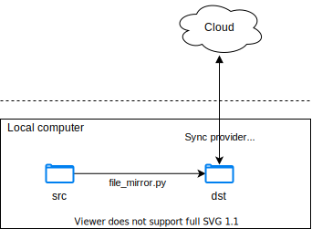

# File Mirror

Mirror files locally. Intended for one-way syncing from a working directory on
your computer to a folder that syncs with the cloud for backup purposes. This
prevents the cloud provider from changing the file while you are working on it,
which is problematic with certain programs. Today, this program ignores changes
from the cloud provider (just for backup), but it can be extended to warn or
sync back changes on-demand (e.g. when it is safe to do so).



## Getting Started

Create a config file at `~/.config/file_mirror/sync_config.json` with the following
contents:

```json
{
    "copy_specs": [
        {
            "src": "~/foo/bar",
            "dst": "~/baz/bar",
            "last_sync_time": null
        },
        {
            "src": "/parent/dir",
            "dst": "~/other_dir",
            "last_sync_time": null
        }
    ]
}
```

Then, just run `file_mirror.py`! It will display the last sync time for each
folder and prompt you for confirmation before copying all the files in each of
the folders to the destination.

## Development

Run `script/setup.py` to install the development dependencies.
